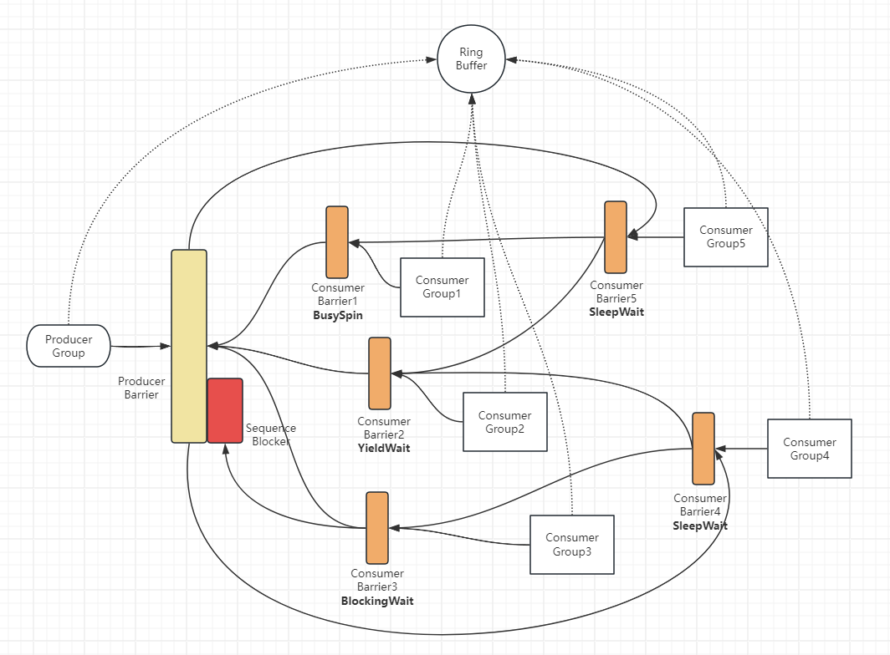

# Disruptor模块

LMAX-Disruptor的C#精简实现，保留其核心设计，更好的抽象和扩展性。

先上架构图：

## 与LMAX的Disruptor差异

1. RingBuffer仅是数据结构，没有额外的职责。
2. Sequencer是协调的集成，而不是生产者屏障，生产者屏障有明确的抽象。
3. 协调的基本单位是屏障`Barrier`，依赖的单位也是屏障，而不是序列`Sequence`。
4. 反转了Barrier和Consumer之间的Sequence依赖。
5. 剥离了Blocker和WaitStrategy，**消费者可以使用不同的等待策略**，但使用同一个Blocker。
6. 库只提供了核心的协调功能，并没有提供BatchEventProcessor这样的具体组件，完全由用户控制。
7. 内置了一套无界缓冲区`MpUnboundedBuffer`。

ps: 很自信地讲，我的设计更容易理解。

## C#实现与Java实现的不同

1. C#的挂起最小单位是毫秒，而1毫秒已是非常长的时间，因此所有Sleep等待策略都没有让用户指定睡眠时间，而是固定1毫秒。
2. C#的`Thread.SpinWait`方法提供了`iterations`参数，因此所有的SpinWait策略都提供了该参数支持。
3. C#的不直接支持C++11的 Acquire和Release内存语义，因此使用Volatile读写代替。
4. C#不支持volatile修饰64位的long和double，因此一些long类型字段未声明为volatile，这与我的日常习惯不同 -- 可能多线程读写的字段，保持为volatile是个好习惯。
5. 为支持结构体类型，`DataProvider`提供了获取元素引用的`ProducerGetRef`和`ConsumerGetRef`接口。

PS：C#其实可以采用FieldOffset来实现缓存行填充，但为了保持代码简单，暂未采用

## 注意事项：

1. C#的挂起最小单位是毫秒，因此慎重使用可能导致线程挂起的api，可能导致较大的延迟
